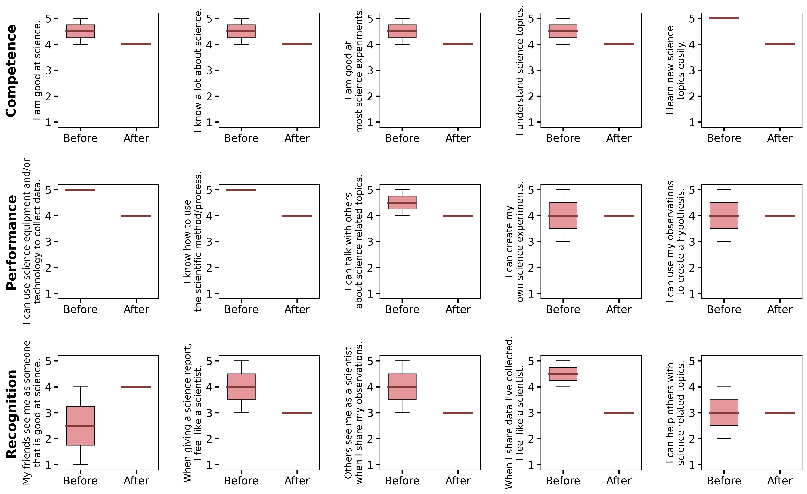

# Nanocamp
Analysis of the science identity construct given before and after Nanocamp.

# Results

### GEAR-UP

GEAR-UP was a one-week long camp taught to high schoolers in various Washingtonian school districts.

Line density plot of answers, by student.

Boxplot of the answers, all students combined.

### Contunuum Education College

The Cont. Ed. Nanocamp was a two-week long camp taught to middle schoolers in various Washingtonian school districts.

Line density plot of answers, by student.

Boxplot of the answers, all students combined.

