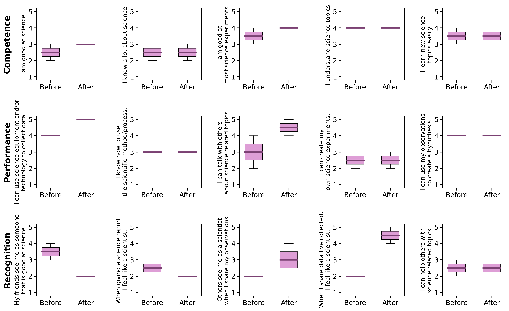
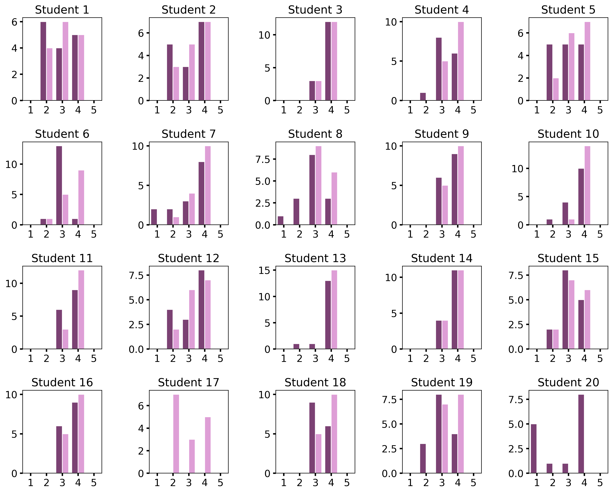

# Nanocamp
Analysis of the science identity construct given before and after Nanocamp.

# Results

The following scale was used rank the responses of the students.
```
1 = Strongly disagree
2 = Disagree
3 = Neither agree nor disagree
4 = Agree
5 = Strongly agree
```

Responses for each question where the student failed to give an answer, either in the pre or post survey, were ommitted. 

## GEAR-UP

GEAR-UP was a one-week long camp taught to high schoolers in various Washingtonian school districts.

Line density plot of answers, by student.

<p align="center">

</p>

Boxplot of the answers, all students combined.

<p align="center">

</p>

The biggest change in the distribution of responses were for the statements `When I share data I've collected, I feel like a scientist.`  (increase in affirmation) and `My friends see me as someone that is good at science.` (decrease in affirmation), even though `I can talk with others about science related topics.` increased in affirmation.

## Contunuum Education College

The Cont. Ed. Nanocamp was a two-week long camp taught to middle schoolers in various Washingtonian school districts.

Line density plot of answers, by student.

<p align="center">

</p>

Boxplot of the answers, all students combined.

<p align="center">

</p>

In general, the Cont. Ed. students (middle schoolers) entered camp more confident in their science identity than the GEAR UP students (high schoolers). However, it is interesting to note that here, the response to `When I share data I've collected, I feel like a scientist.` decreased in affirmation, which was opposite to the GEAR UP camp.


## Combined Results

On average, there did not appear to be a statistical change in the overall science identity of students before versus after Nanocamp.

<p align="center">

</p>

### Changes in Science Identity for Each Individual Student

Looking at the change in responses for individual students, we see most students have very little change in their distributions with only a few select individuals having drastically different respones before and after Nanocamp.

##### GEAR UP

We see students 17 and 20 failed to take the post and pre surveys, respectively.

<p align="center">

</p>


##### Cont. Ed.

The largest difference in responses occurs for Students 11 and 23, while Student 27 likely did not follow directions to properly fill out the survey, and thus can be rejected from the study.

<p align="center">

</p>